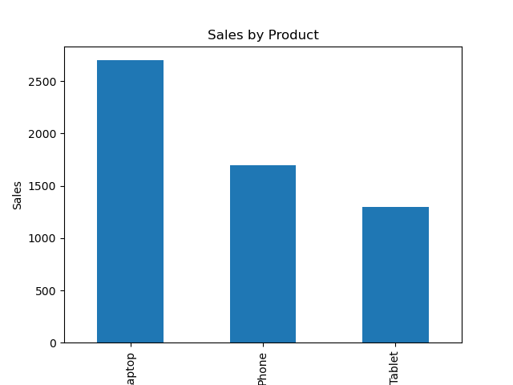

# Sales Data Analysis Project

## Description
This project analyzes sales data to generate insights like total sales, product performance, and regional trends.

## Tools Used
- Python
- Pandas

## Features
- Total sales calculation
- Sales by product
- Sales by region

## How to Run
1. Install Python
2. Run: python analysis.py

## Insights
- Laptop is the highest selling product
- North region has strong performance

## Output

